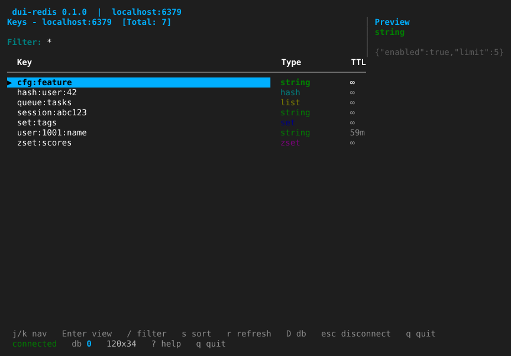
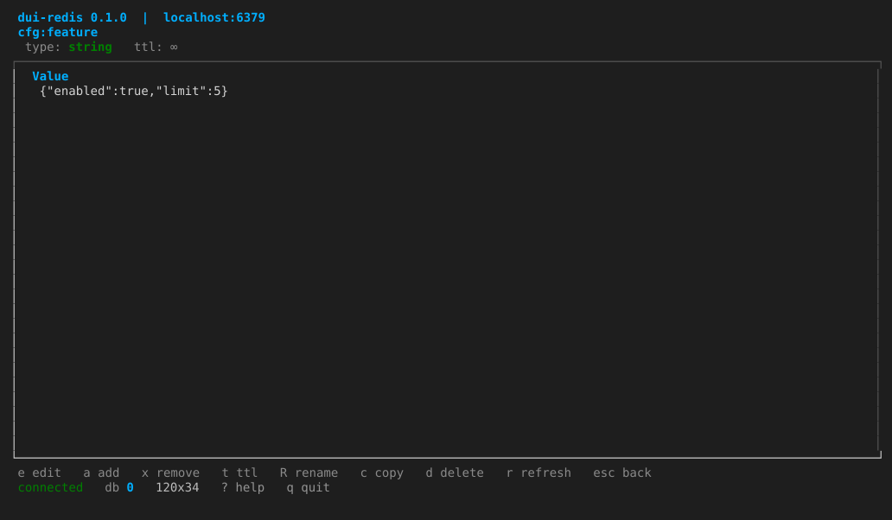
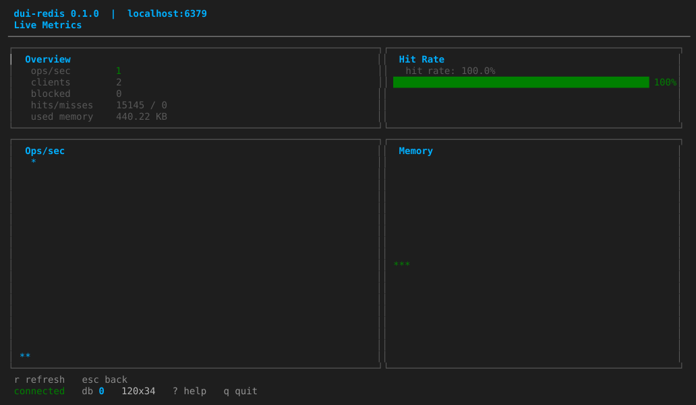
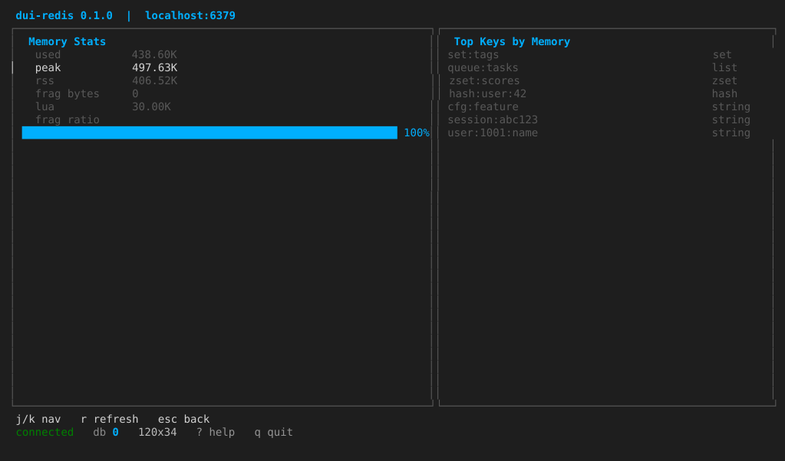
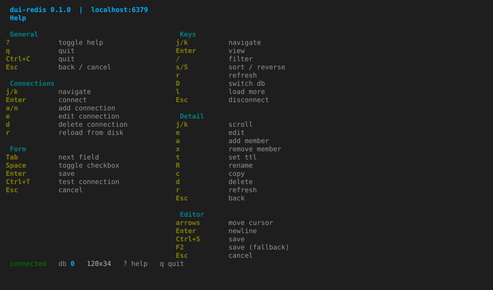
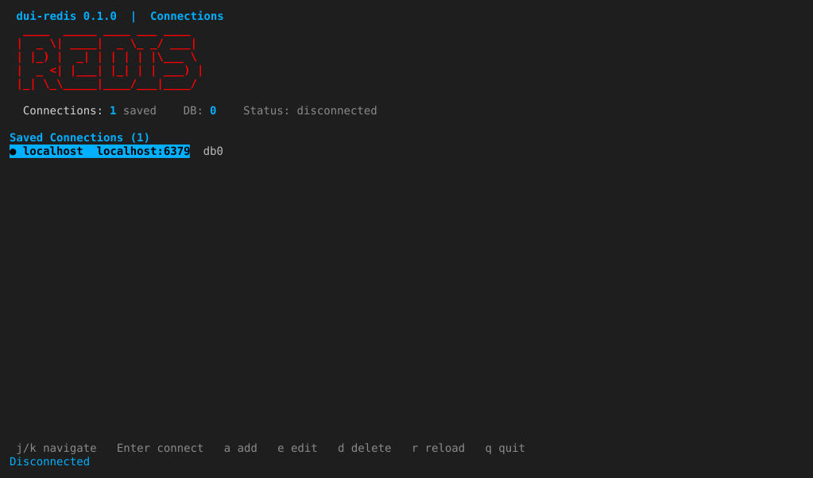

# dui-redis

A Redis terminal UI manager built with [educkui](https://github.com/kasicass/educkui)
(pure Erlang, OTP 28+). It is a port of
[redis-tui](https://github.com/davidbudnick/redis-tui) to Erlang.

> See [`../dui-redis-plan.md`](../dui-redis-plan.md) for the full implementation
> plan and the educkui improvements it depends on.

## Status

**M7 — advanced display and security** (done; some UI deferred). All planned
milestones M0–M7 are implemented. Highlights:

- connection manager, key browser, detail/edit, search/favorites/tree,
  monitoring, ops/cluster (see git history for the per-milestone breakdown)
- schema-less protobuf and Snappy/S2 decoding of binary string values
- JSON syntax highlighting in the detail view
- HashiCorp Vault credential resolution (KV v1/v2, dot selectors)
- TLS via CLI/config; OSC 52 clipboard copy (`y`)
- keyboard and mouse navigation (click a row to select it, wheel to scroll)
- 144 EUnit tests + a Common Test suite; `./scripts/ci.sh`
  (compile → eunit → ct → xref → dialyzer → edoc)

Deferred: live Pub/Sub subscription stream and Keyspace Events; cluster-mode
connection; Key Bindings customization UI; TLS certificate form.

See [`../dui-redis-plan.md`](../dui-redis-plan.md) for the full plan.

## Requirements

- Erlang/OTP 28+
- rebar3
- A terminal supporting raw mode

Dependencies are declared in `rebar.config`:

- `educkui` — git dep (`github.com/kasicass/educkui`)
- `eredis` — hex

## Build and run

Requirements: Erlang/OTP 28+, rebar3, and a running Redis server (4.0+).

```bash
rebar3 compile

# convenience launcher (builds, then passes every flag through)
./scripts/run.sh

# quick connect
./scripts/run.sh --host localhost

# connect with password and database
./scripts/run.sh -h redis.example.com -p 6380 -a mypassword -n 2

# print version
./scripts/run.sh --version
```

Or launch manually:

```bash
# non-interactive erl
PA=$(ls -d _build/default/lib/*/ebin | sed 's/^/-pa /')
erl $PA -noshell -eval 'dui_redis:run([]), init:stop().'

# from rebar3 shell
rebar3 shell
1> dui_redis:run(["--host", "localhost"]).
```

Press `?` for help, `q` to quit, `Ctrl+C` to force quit.

Key screens:

- **Connections**: `Enter` connect, `a` add, `e` edit, `d` delete, `g` groups, `r` reload.
- **Keys**: `j/k` navigate, `Enter` detail, `/` filter, `s/S` sort, `l` load more,
  `F` favorites, `H` recent, `W` tree, `v` search values, `Ctrl+R` regex,
  `Ctrl+F` fuzzy, `Ctrl+G` Redis config, `m` live metrics, `C` cluster,
  `B` bulk delete, `T` batch TTL, `e` export, `I` import, `D` switch DB,
  `esc` disconnect.
- **Key detail**: `e` edit, `a`/`x` add/remove item, `t` TTL, `R` rename,
  `c` copy, `y` copy to clipboard, `J` JSONPath, `d` delete.

The list screens also respond to the mouse: click a row to select it and use
the wheel to scroll.

## Screenshots

| Keys browser | Key detail |
|---|---|
|  |  |

| Live metrics | Memory stats |
|---|---|
|  |  |

| Help | Connections |
|---|---|
|  |  |

Regenerate them with `./scripts/capture-screenshots.sh` (needs tmux, python3
and a Redis reachable on localhost).

## CLI flags

| Flag | Short | Description | Default |
|---|---|---|---|
| `--host` | `-h` | Redis host | |
| `--port` | `-p` | Redis port | 6379 |
| `--password` | `-a` | Redis password | |
| `--user` | | Redis ACL username | |
| `--db` | `-n` | Database number | 0 |
| `--name` | | Connection display name | `host:port` |
| `--cluster` | | Enable cluster mode | false |
| `--tls` | | Enable TLS/SSL | false |
| `--tls-cert` / `--tls-key` / `--tls-ca` | | TLS files | |
| `--tls-skip-verify` | | Skip TLS verification | false |
| `--scan-size` | | SCAN COUNT hint | 1000 |
| `--include-types` | | Fetch key types during scan | true |
| `--config` | | Config file path | `~/.config/dui-redis/config.json` |
| `--version` | | Print version and exit | |

## Layout

```
src/
  dui_redis.erl          entry point (main/1, run/1)
  dui_redis_cli.erl      argparse-based CLI
  dui_redis_root.erl     root educkui component (init/event_to_msg/update/view)
  dui_redis_mouse.erl    mouse layer: click/scroll into list selection
  dui_redis_state.erl    state record + pure transitions
  dui_redis_cmd.erl      async command factories
  dui_redis_config.erl   JSON persistence
  dui_redis_theme.erl    styles
  dui_redis_fmt.erl      formatting helpers
test/                    EUnit tests + Common Test suite (dui_redis_SUITE)
include/dui_redis.hrl    shared record/macros
scripts/                 ci.sh, run.sh, capture-screenshots.sh, ansi2svg.py
```

## Test

```bash
rebar3 eunit      # unit tests
rebar3 ct         # Common Test suite (live case skips if Redis is down)
./scripts/ci.sh   # compile -> eunit -> ct -> xref -> dialyzer -> edoc
```
